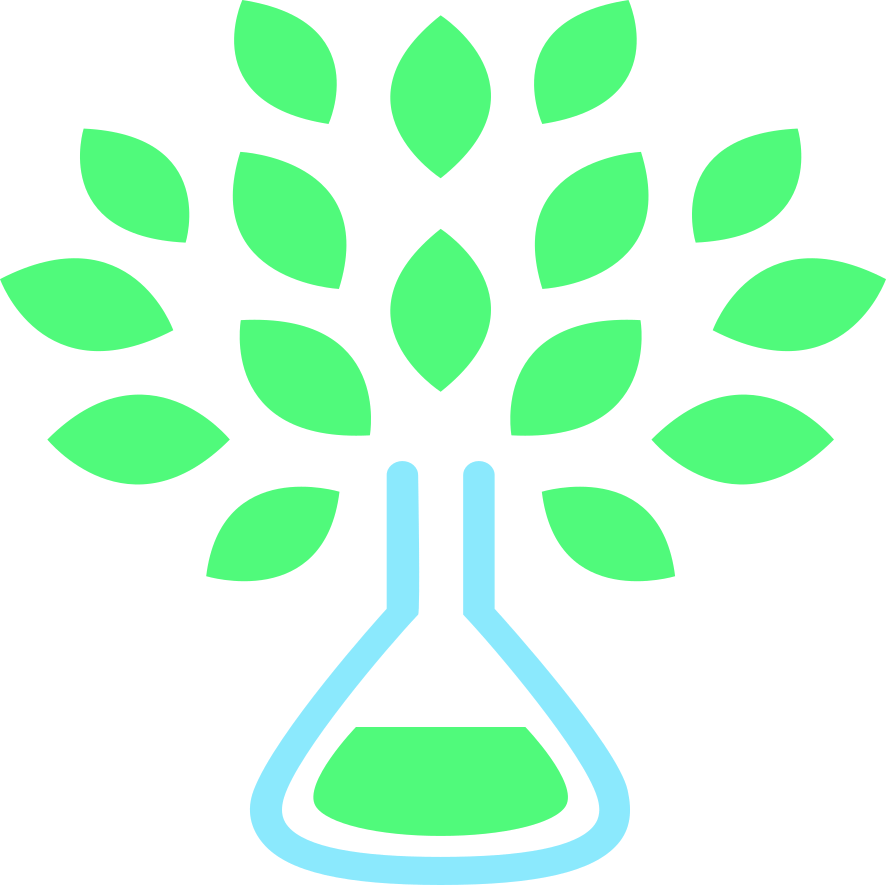

Welcome aboard the journey of **fermi engine**, the future of flexible, reliable, and efficient document management.

## Introduction

**fermi engine**, at its core, is not in competition with highly ranked [_Jasper
Reports_](https://www.jaspersoft.com/reporting-software), but rather is a robust Java/Kotlin API of our report engine.
It acts as the backbone for many wider scopes, with more composite parts that may compete with other report generation
tools. **fermi engine** is the powerhouse that fuels these parts, it's the crux of the system, but not the entirety of
it.

## Technology

**fermi engine** leverages the power of **Kotlin** along with **Spring Boot**, with [
_spring-webflux_](https://spring.io/projects/spring-webflux) endpoints for sleek, concurrent, non-blocking handling of
requests, and optimal system resource utilization. These well-selected technologies empower the engine, ensuring smooth
operations and peak performance.

## API & Ease of Use

Our high-level API makes the complex process of document design simpler. Structural fine-tuning is a breeze, and format
conversions will no longer be a time-sponge operation. From single, dynamic content generation documents to composite,
multi-part marvels, **fermi engine** is your reliable partner.

## Compatibility & Transformation

**fermi engine** shines when it comes to compatibility with various document types, and its ability to maintain the
integrity of document formats, such as PDF. We've constructed a robust transformation process that not only converts but
also safeguards formatting and overall aesthetics, making it a trustworthy tool for your crucial document workflows.

## License

The prime advantage of **fermi engine** lies in its license - the **BSD2 license**. Designed as an alternative to the
restrictive [_iText_](https://itextpdf.com) (which is not [_free for commercial usage as per its newer
versions_](https://itextpdf.com/en/how-buy/legal/are-itext-5-core-library-and-other-versions-free)), this engine offers
the developer community a more flexible usage policy, assuring unrestricted innovation.

## Join us

This isn't solely a project - it's a revolution in document generation and management. We envision a future where
developers joyfully engage with documents, making document management processes more streamlined and efficient. We
cordially invite you to be a part of this fascinating journey. Start exploring, contribute, and let's build the future
of document generation together with **fermi engine**!

## Valhalla labs

This project is being built by  [_valhalla labs_](https://valhalla-labs)

